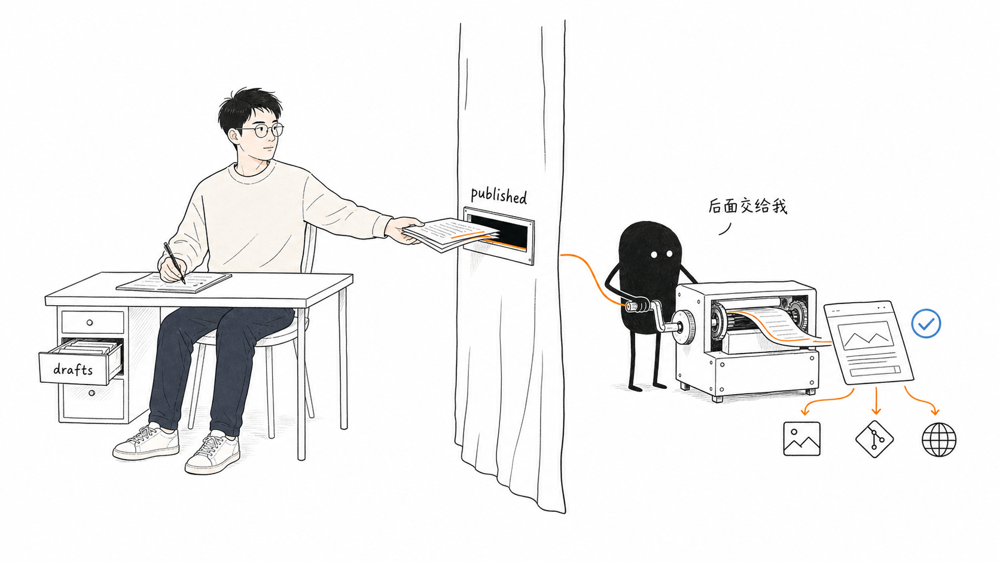
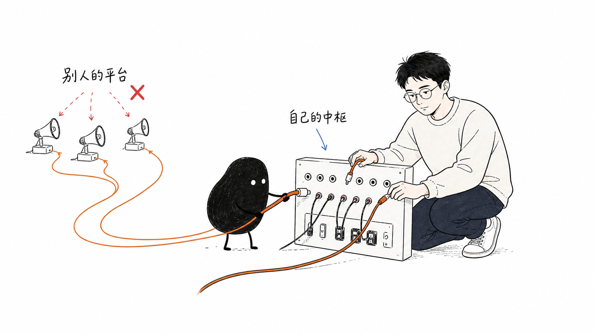
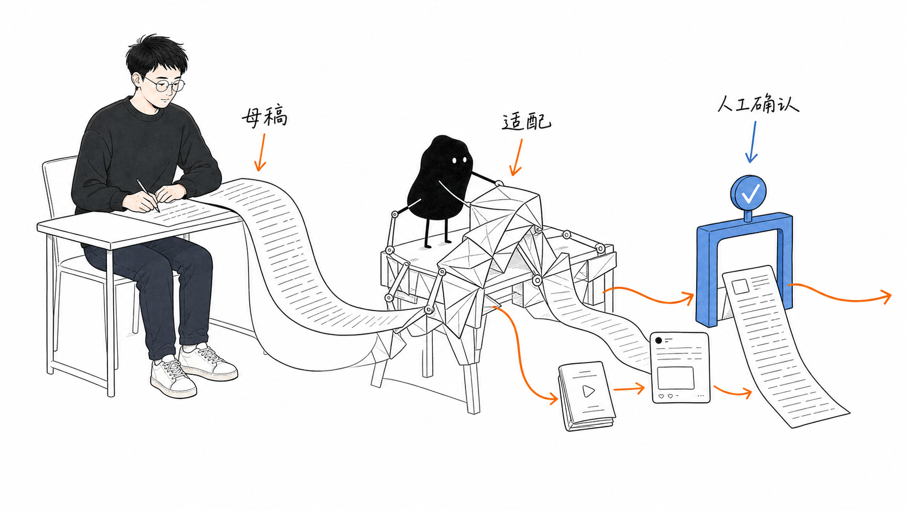

# 我为什么要给自己造一个 AI 原生的个人内容中心

#AI-Native个人内容系统  #AI知识库 #Obsidian #AI #产品 #独立开发 #essay

一开始，我其实没想过要做一个“AI 原生的个人内容中心”。

我只是想在个人主页里加一个 Writing 页面，放点平时写的东西。页面做出来时我还挺开心：产品现场、日常的思考、投资的复盘、AI 的实践，还有那些暂时没想明白的东西，终于有地方可以放了。

但紧接着我就卡在一个很实际的问题上：文章怎么放进去？

最开始想的是一套很传统的静态博客方案。比如用 Jekyll 写博客，每新建一篇 Markdown，都先在文件顶部维护一段 YAML：标题、日期、栏目、摘要一项项填好，网站再根据这些信息生成文章页和列表。这种方式很成熟，逻辑上也没有任何问题，但我的第一反应却是：**太累了。**

我写东西本来就不是一件很稳定的事。有时是一个完整的想法，有时只是凌晨写下的几句话。如果每次开始之前，还要先像填表一样决定它属于哪一类、摘要怎么写、日期用什么格式，我大概会在真正动笔之前就失去兴致。

我也不想为了发博客，再把自己搬进 Notion 或另一套写作后台。我已经把自己的 AI 知识库和日常工作流搭在了 Obsidian 上，平时收集的资料、冒出来的想法和项目记录都沉淀在这里。新写的东西对我来说也不是发出去就结束了，它还应该进入 AI 可以检索和调用的那一层，成为以后继续思考的材料。如果一套发布系统反而把写作从这条工作流里切出去，它做得再完整，对我也没有意义。

最后，我把要求压缩成了一句话：

> 我只管正常写。写完从 drafts 拖到 published，博客这边的发布流程自动完成。

现在回头看，这句话才是这个项目真正的起点。

## What：我到底想做一个什么？

我说的“个人内容中心”，不是再做一套写作后台，也不只是把同一篇文章发到更多平台。

它围绕 Obsidian 展开：我只在这里写，博客保存最完整的版本。目前先把博客发布做到自动，接下来再让同一个发布动作同步更新 AI 知识库。需要去其他平台时，AI 可以根据母稿整理出不同版本，最后还是由我确认。

这里的“AI 原生”，不是在编辑器旁边多放一个生成按钮，也不是把每个步骤都交给 AI。搬文件、收图片、提交 Git 和生成网页，这些明确的事由普通脚本完成；AI 只负责需要理解内容的部分，比如建立索引、找回过去的判断，以及根据母稿生成渠道版本。

它不是一台替我写作的机器。更准确地说，它是想把“写完之后”那段最容易消磨热情的路，修得短一点。

我不是想拥有更多喇叭。我想先有一个属于自己的内容中心，再决定内容从哪里出去，又回到哪里。

## Why：为什么值得自己做？

说实话，如果目标只是把一篇文章发到更多平台，市面上已经有很多工具，自己做未必划算。

但我慢慢发现，自己真正在意的，是能不能把写作、沉淀、AI 调用和对外发布连在一起。之所以想自己做，也是因为下面这几个别扭。

### 我不想每写一次，都先服从一套系统

很多工具的出发点是“怎么管理内容”，但我更关心“怎么别让管理妨碍内容”。

一段突然想到的话，原本可能两分钟就能写下来。加上选分类、填摘要、找封面、复制到后台，它就从一个念头变成了一件待办事项。待办事项一多，最容易被推迟的往往就是写作。

所以这个系统的第一个目标，不是提高流量，而是别让我在发出去之前就放弃。

### 我希望原文真的属于自己

平台适合让人看见，但不适合做唯一的档案。编辑器会变，规则会变，有些平台连已发内容都不方便导出。

我希望最完整的文章始终是本地的一个 Markdown 文件。它可读、可搜索、可迁移，几年后换工具也不需要先向谁申请。

这听上去有点执拗，但写作本来就是一件需要长时间积累的事。我不想把这份积累建在别人的地基上。

### 我想让 AI 少写一点，多搬一点

我并不缺一个能在三十秒内写出五千字的 AI。真正缺的，是一个能理解我已经写了什么，然后帮我去做那些重复加工的助手。

一篇长文、一条短帖、一段视频口播，通常不是三个想法，而是同一个判断的三种讲法。复制、删减、改标题、调格式，这些事可以交给机器。但哪个判断值得讲，这句话到底是不是我的意思，不应该一起被外包出去。

### 我不想写完之后，只留下一个链接

一篇文章发出去以后，最容易留下的是一个网页链接，或者几份散落在不同平台上的副本。它们确实被保存了，但保存下来不等于真的沉淀下来。

对我来说，文章本身也是知识库的一部分。文章本来就在 Obsidian 里，所以这里说的 ingest 不是再复制一份，而是为它建立 AI 可以检索的索引和关联。Obsidian 保留原文，AI 索引层负责找到和调用它，两层合在一起，才是我想要的知识库。

## How：第一版怎么做？

我一开始也很容易把它想大，但先做一套“什么都能干”的系统，很可能只是把不写东西的原因，从“发布太麻烦”换成“系统还没做完”。

现在已经跑通的，是 Obsidian 到个人网站的发布链路。AI 知识库的索引和各平台的渠道版本，还是接下来要做的事。

### 1. 先跑通 Obsidian 到个人网站

不填 YAML，不去网站后台，也不维护另一份索引。标题来自文章，Tag 由我随时添加，摘要、阅读时长和发布日期交给系统处理。

把文件从 `drafts` 拖进 `published`，是我唯一需要明确做的发布动作。这个动作之后，文件命名、图片收集、Git 提交和网页生成自动完成。

这条路刚跑起来时，我也踩了点坑，但这些小麻烦反而让我想明白了一件事：所谓“自动”，不是把所有步骤都省掉，而是让正常的流程足够顺，出了错也能清楚地知道它停在哪里。

### 2. 发布的同时，让知识库知道这篇文章

下一步是在文章生成博客页面后，继续解析其中的标题、核心判断、案例、Tag 和配图，再更新 AI 知识库里的索引和关联。下一次我研究类似问题时，AI 应该能把这篇文章找回来，而不是只知道它躺在某个文件夹里。

这里的 AI 不是根据一个主题凭空再写一篇，而是在母稿的范围内整理和重组。AI 生成的渠道版本里，每个重要判断都应该能在原文中找到依据。

### 3. 再从母稿做渠道版本，但不直接发

博客可以完整铺开，短帖只能留一个判断，图文需要更快地进入正题，口播稿则必须读起来像人话。

这些差异值得自动处理，但生成完成不等于发布完成。所有版本会先放进待确认列表。我看一遍，改掉不像我的话，再决定它去哪里、什么时候发。

一份母稿，几种讲法。AI 可以帮我换形状，但不替我决定要说什么。

## 下一步

先把个人网站和现在这条发布链路做好，然后再一个一个平台慢慢打通。下一个可能会先试试公众号。具体会遇到什么坑，我现在也不知道，等真踩到了再来分享。
