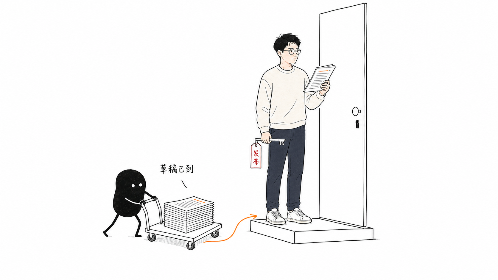
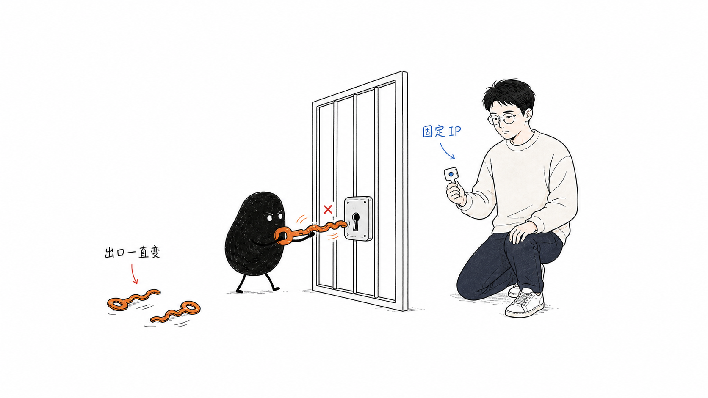
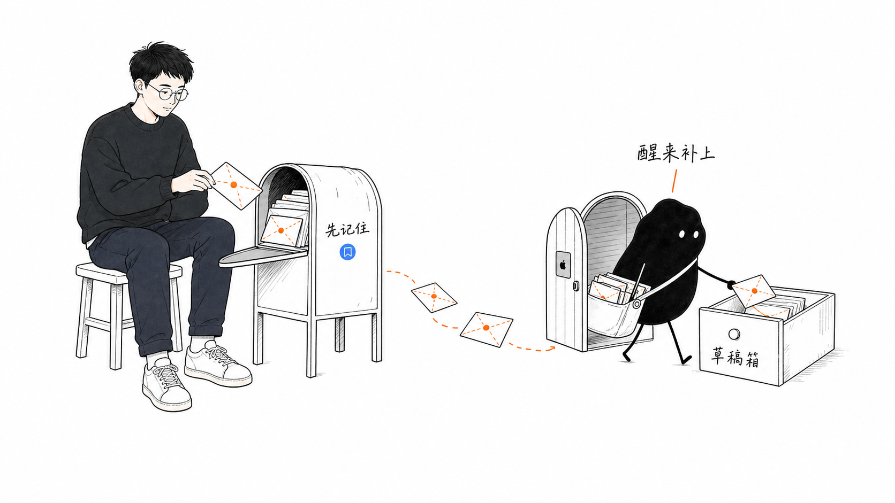

# 我把个人博客接到了公众号草稿箱

#AI-Native个人内容系统 #微信公众号 #Obsidian #自动化 #独立开发 #AI #essay

第一篇写完没几天，我就开始接公众号。这是《给自己造一套内容系统》的第二篇。

## 我以为，顺手就能接上

我当时想得挺简单的。个人网站已经能从 Obsidian 自动发布，文章、图片和永久链接都是现成的。公众号也有接口，把 Markdown 转一下，再调一下，应该也就差不多了吧。

结果没走两步就卡住了，而且问题还不在 Markdown。

## 第一下就被权限拦住

我把账号配置好，拿到了 access token，草稿接口也通了。我心想，后面再把发布和下架接上，不就完了嘛。

结果试到发布接口时，微信返回了 `48001 api unauthorized`。

说白了，当前这个账号可以通过 API 创建和更新草稿，但没有发布相关接口的权限。换工具也没用，账号没有的权限还是没有。

我原本想的是：文章从 `drafts` 移到 `published`，个人网站和公众号一起更新，撤稿时也一起消失。结果只能先把草稿准备好，真要发出去，还是得我自己点一下。

不过我在公众号发文章前本来就会再读一次。有时换个标题，有时删掉不适合公众号的段落，也可能临时决定不发。标题、封面和排版先让程序准备好，发布手动做，对我来说倒也能接受。

## 我又开始嫌麻烦了

草稿能用以后，我第一反应就是把同步放在本机，省事嘛。文章本来就在这台 Mac 上写，提交以后顺手调用接口，看起来最直接。

问题是，我不只在这一台电脑上写。其他设备改完推回 GitHub，也应该能触发同步。每台设备都装 Hook、配密钥和白名单，光想就觉得麻烦。

所以我把同步的起点放到了 GitHub。写作设备只负责把文章推上去，再由另一台固定的机器接手微信。

但 GitHub Actions 和当时在用的 Vercel Hobby，都没有可以直接拿来加白名单的固定出口 IP。服务器当然能解决，可为了同步一个公众号草稿，再养一套服务，说实话有点重了。

绕了一圈，我还是用回了这台 Mac。只是它不再负责记住有没有新文章，GitHub 负责记住，Mac 在线时负责把文章送进草稿箱。

## Mac 关机了，也没关系

现在，无论我在哪台设备写，只要把 `published` 里的文章推到 GitHub，网站照常构建。Mac 每五分钟检查一次 `main`，发现新版本就把新增或改过的文章放进公众号草稿箱。

Mac 关机时不会同步，但文章的最终状态还在 GitHub 上。下次开机再追到最新版本就行，中间改过多少次其实不重要，草稿箱里只需要最后那一版。

后台任务也不用我平时写作的目录。它在 Mac 的应用数据目录里另放了一份仓库，只在那里拉取和同步，不会碰到还没写完的草稿。

## 草稿到了，我再看一遍

文章移进 `published` 并推到 GitHub 后，个人网站会更新，公众号里也会多出一份草稿。我要做的其实就几步：打开微信后台，再读一遍，点发布。

账号权限本来就不允许自动发布，这一步手动做也没给我添多少麻烦。那就先这么用着。

公众号先按这套跑，不急着再接更多平台。下一步先做文章索引，省得以后写到类似主题又翻不回来。先把这个问题解决，再写第三篇。
