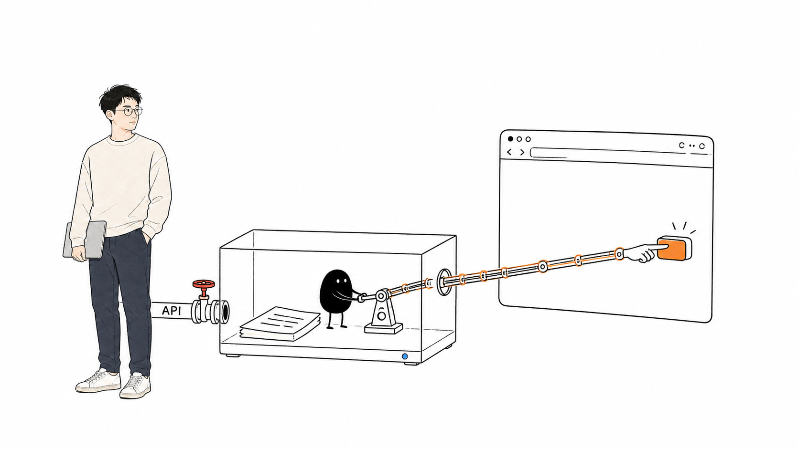
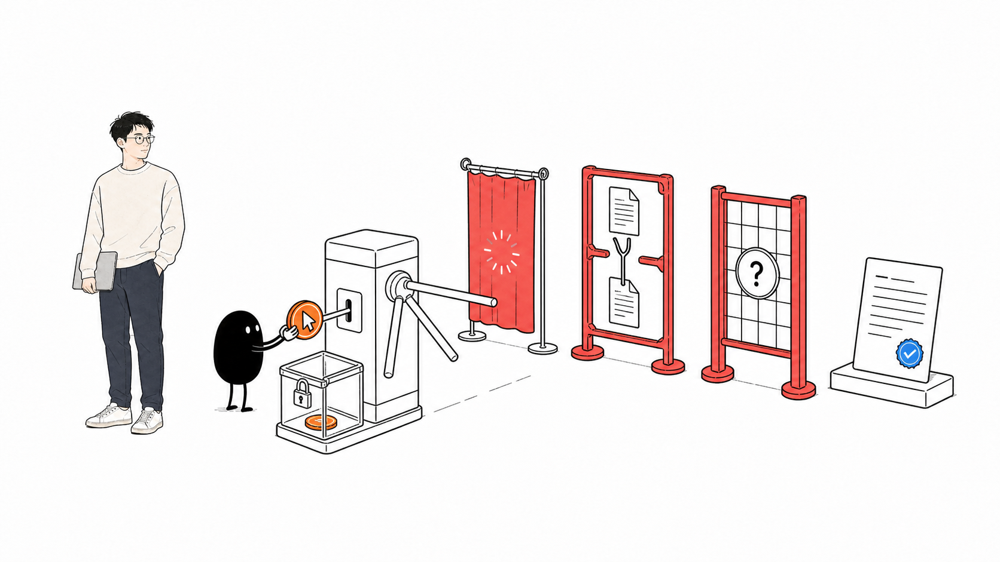

# 我给公众号补上了最后一步自动化

#AI-Native个人内容系统 #微信公众号 #浏览器自动化 #自动化 #独立开发 #AI #essay

草稿箱跑顺以后，我每次发公众号还剩下同一件事：打开后台，找到刚同步进去的文章，点发表，再点一次确认。

前面的 Markdown 转换、图片上传、封面、排版和草稿更新都已经自动了，偏偏最后两下还得我自己来。我盯着那个按钮看了几次，心想，总不能每次都专门打开后台吧。

那就把最后一步也接上。

## 接口不给，我只好去点网页

我最先试的当然还是 API。草稿都能通过接口创建和更新，顺着往后调发布接口，看起来最省事。

结果还是第二篇里那个错误：`48001 api unauthorized`。

说白了，我当前这个个人账号有草稿相关权限，但没有发布接口权限。这个限制不在代码里，换个库、换台机器都不会消失。想继续自动化，只剩公众号后台本身这条路。

我最后用的是浏览器方案。Mac 上单独放一份 Chrome 登录状态，草稿通过 API 同步成功以后，再由浏览器打开公众号后台，找到对应文章，点发表，确认，然后回到发表记录里检查结果。

这里没有让 AI 临场看页面，也没有按屏幕坐标盲点。运行时就是一套固定规则：该出现什么入口、文章怎么对上、按钮叫什么、确认框里应该有什么。对不上就停。

## 真写起来，最麻烦的不是点击

一开始我也觉得，浏览器自动发布不就是 `click()` 嘛。

真写下去才发现，点击反而是最短的那一行。前面要先回答一堆问题：草稿箱里有两篇同名文章怎么办？页面还在加载时没找到文章，算不存在吗？点完以后网络断了，下次运行要不要再点一次？如果弹出来的不是普通确认框，而是验证码或者账号验证呢？

这些情况平时手动操作不难判断，人看一眼就知道该等一下还是返回。换成后台任务，它只要猜错一次，就可能重复发文，或者点到另一篇文章。

所以我给每篇文章留了一段发布状态。草稿创建成功以后，它才会进入待发布；真正点击之前，程序先记下“我准备点了”；点击之后如果没法确认结果，就停在待核对状态，下一次运行也不会再补一刀。

已有文章也不会因为这套功能上线就突然被补发。第一次开启时会先把当前内容记成基线，只有之后新进入 `published`、并且草稿同步成功的文章，才有一次自动发布资格。

浏览器这边也尽量保守。标题要完全一致，能核对原文链接时就一起核对；出现两个候选、登录失效、验证码、陌生对话框，或者页面结构变了，全部停在点击前。Mac Agent 还是串行执行：先更新后台仓库，再同步草稿，最后才进入浏览器。前面失败，后面不会硬跑。

## 撤回也不能靠“文件不见了”来猜

既然发布接进来了，我顺手也把撤回的流程理了一遍。

我想保留原来的写作习惯：把文章从 `published` 移回本地 `drafts`，网站撤稿；如果公众号已经发出去了，再处理公众号里的文章。

问题是，`drafts` 本来就不会上传 GitHub。Mac Agent 只能看到线上那份文章消失了，它不知道这是我主动撤回，还是文件被误删、分支没同步好，甚至只是一次临时状态。

现在移动文章时，Git hook 会额外生成一个不带正文的撤回标记，里面只有文章 ID 和时间。普通删除没有这张标记，只影响网站，不会碰公众号。文章还没发布时，标记只会取消待发布；确认已经发出去以后，才会进入浏览器撤回流程。

这部分也留了独立开关。毕竟自动发错已经很烦了，自动删错更麻烦。

## 几轮复核，专门找那些很小的缝

这次实现被拆成了几轮子任务，每一轮写完还有复核。很多坑都不是主流程里看得见的。

比如发表记录还在加载，页面暂时显示零篇，程序不能把它当成“文章肯定没发”；撤回后公开链接还能访问，也不能因为后台列表里没找到就宣布成功；文章从 drafts 恢复以后，旧的撤回标记不能在未来某次普通删除时突然重新生效。

这些边角最后都变成了测试。完整测试跑到 183/183，构建和两条 dry-run 也都通过。浏览器测试用的是本地页面和本机 Chrome，没有登录真实公众号，也没有真的发文或撤回。代码最后通过编号 3 的 PR 合并进了 `main`。

## 现在这条链路，已经到哪了

从程序结构上看，最后一步已经接上了：文章进入 `published`，网站更新，Mac 创建公众号草稿，浏览器接着完成发布；移回 drafts 时，也有对应的取消和撤回状态。中间任何一步失败，状态会留在原地，不会靠重复点击碰运气。

但目前我还没有把它当成已经在线跑起来的无人值守功能。自动发布和自动撤回的开关仍然默认关闭，真实公众号“已发表文章列表什么时候算加载完整、结果什么时候算找全”也还没有完成受控验收。现在这道判断拿不准，程序就会停在点击之前。

剩下的工作倒不需要再重写一套系统。找一篇单独准备的新文章，在真实账号里把登录、列表识别、精确匹配、发表和结果核对完整走一遍，再决定是否打开自动发布。撤回则会用另一篇可丢弃的测试文章单独验收，不和发布一起冒险。

所以目前的状态是：路已经铺到按钮前了，安全栏杆也都装好了，最后还差一次我在场的真实通车。整体上我已经挺满意，至少它不会为了显得“自动”就假装自己什么都看懂了。

## 然后去看看小红书

公众号这条线先做到这里。下一篇我准备研究小红书：同一篇原文能不能自动整理成适合小红书的版本，图片和排版要怎么处理，最后又能自动到哪一步。

具体能不能顺利接上，我现在也不知道。先去试，踩完坑再写。
