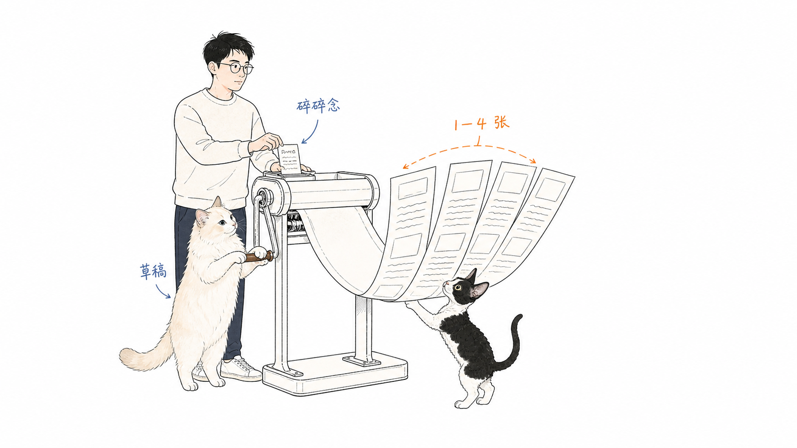
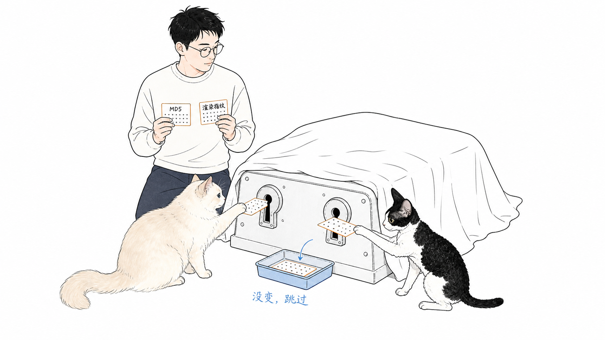
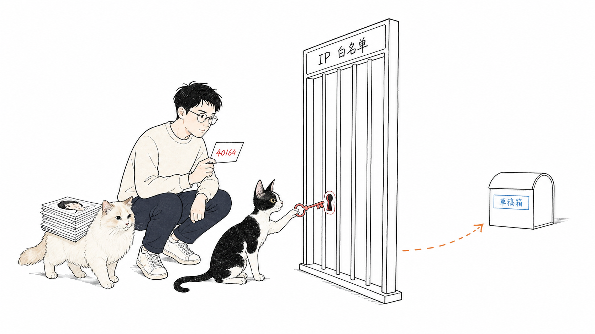

# 我给碎碎念补上了公众号贴图

#AI-Native个人内容系统 #微信公众号 #Obsidian #碎碎念 #自动化 #独立开发 #AI #essay

小红书 MCP 还是不太稳定。

第三篇写完时，我说接下来去看看小红书。我真去试了，前后换了几种方案，运行起来依旧会碰到一些不太可预期的问题。我暂时不想把写作流程压在这么一个环节上，就先放了放。

结果这周，更近的问题自己冒了出来。

我写了一条很短的碎碎念，讲的是早上在路上想到一个模型持续学习的点子，第二天就看到 Ilya 发了一个几乎沿着同一条思路走的模型。全文只有几段感慨，很快就写完了。它进了网站，我等了一会儿，公众号草稿箱却没有出现新内容。

于是！！！我又开始更新这套内容系统。

## 短短几句话，还没有自己的路

我最早的写作页很会展示“最新一篇”。一张很大的卡片放在页面中间，读者可以看到它，但很难看出我其实同时在写两种东西。

一种是连续的长文，像《AI 原生个人内容系统》这样一篇接一篇。另一种是碎碎念，有时只是开会或上班路上冒出来的一个念头。

这次我先把写作页拆清楚了。连续的文章放进“专辑”，单独的长文放在“独立文章”，短的就落在“碎碎念”里。多个专辑在滑轨上排开，两侧没选中的封面会稍微斜过去，有点像以前 iPod 横过来的 Cover Flow。

网站上有了位置，公众号这边还沿用着长文的习惯。长文有明确的标题、封面和正文排版。碎碎念往往连 H1 都没有，系统会从开头硬凑一个标题。我这篇的标题就把前两句拼在了一起，看着就很勉强。

## 我给碎碎念单独铺了一条路

现在，Markdown 里的 `kind: note` 会把内容送进碎碎念流程。网站继续显示原文，微信这边则生成原生的 `newspic` 草稿。

正文会被排成 1080×1440 的竖图。短的用一张，长一些的自动分页，最多四张。没有标题时，公众号里会用“碎碎念 · 日期”，不再拿正文的前两句硬拼。

贴图里还有 Mochi 和 Molly。Mochi 是火焰色布偶，Molly 是黑白德文。以前配图里 Ian 身边的小黑，现在换成了它们。系统可以稳定地选一只，我也可以在文件里直接指定，避免同一条碎碎念每次重新生成都换个主角。

## 文字没变，就别再做一遍

碎碎念很短，后面的动作却不少。分页、生成图片、上传素材、新建草稿，每一步都花时间，还可能触发微信的接口限制。

我最后用原始 Markdown 的 MD5 判断文字是否改过。内容一样时，后面的分类、渲染、上传和草稿接口都可以跳过。

只看 MD5 也会漏掉一类变化。文字没动，字体、猫的素材、Chrome 版本或渲染器改了，最后的图片仍然可能不同。所以每篇还会记一份渲染输入指纹。这两份记录都对得上，系统才会真正跳过。

生成的 PNG 只待在操作系统的临时目录里。上传完就清理，仓库里只留原文和必要的状态。

## 自动化先停在草稿箱

这周一开始，我还想把公众号的自动发布和自动撤回一起跑通。发布接口的 `48001 api unauthorized` 还在，所以只能让浏览器去点后台。我把标题精确匹配、登录状态、发布结果和撤回标记都做了保护，也补了一轮测试。

真实跑起来时，Chrome 、登录态和公众号页面还是会给这条链路带来不确定性。我不想让一次页面变化或浏览器报错，直接变成一次意外发文。

最后我把 Mac Agent 收回到一件事。它只负责把文章和碎碎念新建或更新到草稿箱。实际发布、已发文章的撤回和删除，都留在微信后台里手动做。

我写完后本来就会在公众号里再读一遍。现在程序帮我把原文、排版和贴图准备好，最后那一下由我自己来，倒也能接受。

